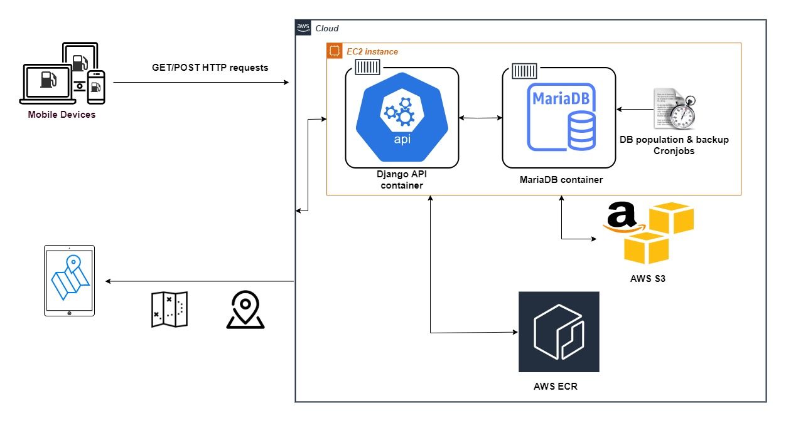

# FuelOpt

With the energy crisis hitting Britain in September 2021 and worries of a fuel shortage, we 
devised an app to help people avoid queues and save the environment. FuelOpt is a user-friendly,
open-source, platform-independent and socially helpful app to assist motorists in planning and optimising 
their fuel-filling journeys in terms of cost, time, and fuel efficiency. Currently, the application
focuses on the geographic area of London, UK, where the shortage was mostly felt.

## Prerequisites

Before you begin, ensure you have met the following requirements:

* Installation of all the required Python modules with:  `pip install -r backend/requirements.txt`
* You are using Python >= 3.8.

## Architecture

  

## Contributing to FuelOpt
To contribute to ***FuelOpt***, follow these steps:

1. Fork this repository.
2. Create a branch: `git checkout -b <branch_name>`.
3. Make your changes and commit them: `git commit -m '<commit_message>'`
4. Push to the original branch: `git push origin <project_name>/<location>`
5. Create the pull request.

Alternatively see the GitHub documentation on [creating a pull request](https://help.github.com/en/github/collaborating-with-issues-and-pull-requests/creating-a-pull-request).

## Useful links

- [Flutter documentation](https://flutter.dev/docs)
- [Lab: Write your first Flutter app](https://flutter.dev/docs/get-started/codelab)
- [Cookbook: Useful Flutter samples](https://flutter.dev/docs/cookbook)
- [Docker documentation](https://docs.docker.com/)

## Authors

* **Marcos-Antonios Charalambous** - *mc921@ic.ac.uk*
* **Alicia Jiayun Law** - *ajl115@ic.ac.uk*
* **Dimosthenis Tsormpatzoudis** - *dt521@ic.ac.uk*
* **Nadim Rahman** - *nr421@ic.ac.uk*
* **Dennis Duka** - *dn321@ic.ac.uk*
* **Ye Liu** - *yl10321@ic.ac.uk*
* **Maxim Fishman** - *maf221@ic.ac.uk*

## License
[GNU GPLv3](https://choosealicense.com/licenses/gpl-3.0/)
