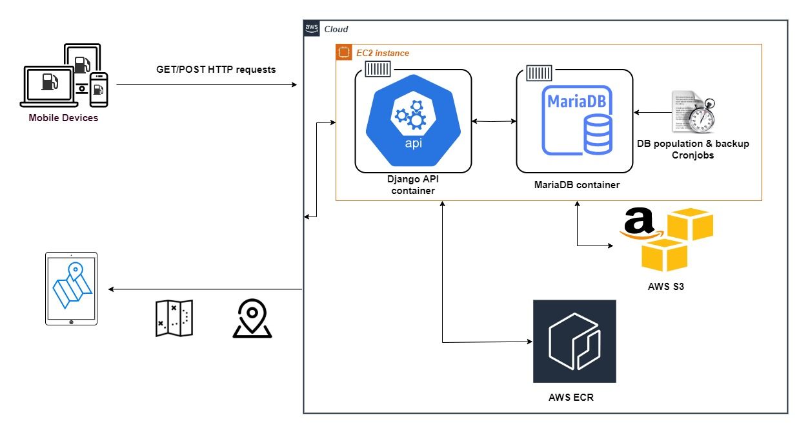

# FuelOpt

With the energy crisis hitting Britain in September 2021 and worries of a fuel shortage, we 
devised an app to help people avoid queues and save the environment. FuelOpt is a user-friendly,
open-source, platform-independent and socially-helpful app that assists motorists in planning and optimising their fuel-filling journeys in terms of cost, time, and fuel efficiency. Currently, the application focuses on the geographic area of London, UK, where the shortage was most prominent.

Check out our presentation video [here.](https://www.youtube.com/watch?v=NGsksgoK-4Q&ab_channel=NadimRahman)
## Documentation
The FuelOpt project documentation is located at [doc/api documentation](https://github.com/mchara01/FuelOpt/blob/main/doc/api%20documentation). Alternatively, you can find it here: http://18.170.63.134:8000/api-docs/

## Prerequisites

Before you begin, ensure you have met the following requirements:

* You installed of all the required Python modules with:  `pip install -r backend/requirements.txt`
* You are using Python >= 3.8.
* You have entered your API keys (e.g AWS, Google) where necessary. The [config_sample.py](https://github.com/mchara01/FuelOpt/blob/main/sample/config_sample.py) in the **sample** directory illustrates how the API key should be in the config.py file you will must create. 

## Architecture

  

## Running the app

### Android

To try this app on an Android device, scan the QR code or use the link below on that device.

https://install.appcenter.ms/users/gmnapster/apps/fuelopt/distribution_groups/fuelopt%20app%20testers

### iOS

Due to Apple's strict distribution guidelines, only the developmental build can be accessed for now. To run this build, **an Apple machine with Xcode is required**.

1. [Setup the development environment](#setting-up-the-development-environment)
2. Clone this repository.
3. Generate your own Google Maps API key from [here](https://developers.google.com/maps/documentation/ios-sdk/get-api-key) and supply it in the ***src/ios/Runner/keys.strings*** file by replacing "API_KEY_HERE".
4. Generate your own LocationIQ key from [here](https://locationiq.com/geocoding) and supply it in the ***src/keys.env*** file by replacing "API_KEY_HERE".
5. [Configure your iOS device for testing](#configure-an-ios-device-for-testing)
6. Open the src/ios/Runner.xcworkspace folder in Xcode.
7. Make sure your iOS device is connected, on, and unlocked.
8. Press the play button in the top menu bar of Xcode.

### Setting up the development environment

1. Install the Flutter SDK from here: [https://flutter.dev/docs/get-started/install](https://flutter.dev/docs/get-started/install).
2. Make sure to set the PATH variable as mentioned in the installation link to access the Flutter command-line interface.
3. Install Cocoapods from here: [https://cocoapods.org](https://cocoapods.org)
4. Make sure Cocoapods is accessible from the command line.
5. Run `flutter doctor` in the command line to make sure the Flutter SDK properly installed.
6. Navigate to the ***src*** directory of this project.
7. Run `flutter packages get` to get the necessary Flutter dependencies.
8. Navigate to the ***src/ios*** folder
9. Run `pod install` to get the necessary ios dependencies.

### Configure an iOS device for testing

#### Simulator
1. Open iOS/Runner.xcworkspace file in Xcode.
2. At the top menu bar of Xcode, there is button "Runner > *some ios device*"
3. Click on it, and choose any device you like.

#### Real device

Please refer to this article: [iOS Device Setup](https://medium.com/front-end-weekly/how-to-test-your-flutter-ios-app-on-your-ios-device-75924bfd75a8)

## Testing
To run the unit tests on our backend API methods, in the terminal:
1. cd into the FuelOpt directory: `cd FuelOpt`
2. Execute: `python ../FuelOpt/src/backend/manage.py test ../FuelOpt/test/`

## Contributing to FuelOpt
To contribute to ***FuelOpt***, follow these steps:

1. Fork this repository.
2. Create a branch: `git checkout -b <branch_name>`.
3. Make your changes and commit them: `git commit -m '<commit_message>'`
4. Push to the original branch: `git push origin <project_name>/<location>`
5. Create the pull request.

Alternatively see the GitHub documentation on [creating a pull request](https://help.github.com/en/github/collaborating-with-issues-and-pull-requests/creating-a-pull-request).

## Useful links

- [Flutter documentation](https://flutter.dev/docs)
- [Lab: Write your first Flutter app](https://flutter.dev/docs/get-started/codelab)
- [Cookbook: Useful Flutter samples](https://flutter.dev/docs/cookbook)
- [Docker documentation](https://docs.docker.com/)

## Authors

* **Marcos-Antonios Charalambous** - *mc921@ic.ac.uk*
* **Alicia Jiayun Law** - *ajl115@ic.ac.uk*
* **Dimosthenis Tsormpatzoudis** - *dt521@ic.ac.uk*
* **Nadim Rahman** - *nr421@ic.ac.uk*
* **Dennis Duka** - *dn321@ic.ac.uk*
* **Ye Liu** - *yl10321@ic.ac.uk*
* **Maxim Fishman** - *maf221@ic.ac.uk*
* **Wei Sin Loo** - *wl2121@ic.ac.uk*

## License
[GNU GPLv3](https://choosealicense.com/licenses/gpl-3.0/)
